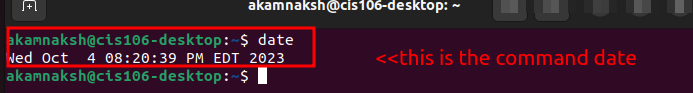
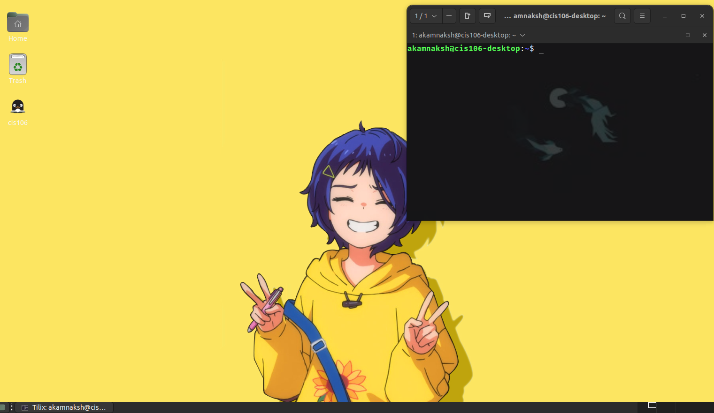

# Lab 3 Submission

## Question 1

## Question 2

## Question 3
| Program purpose     | Package Name       | Version            |
| ------------------- | ------------------ | ------------------ |
| Play a tetris game  | kblocks            | 4:21.12.3-0ubuntu1 |
| Play a video file   | dragonplayer       | 4:21.12.3-0ubuntu1 |
| Browse the internet | epiphany-browser   | 42.4-0ubuntu1      |
| Read your email     | kmail              | 4:21.12.3-0ubuntu1 |
| Play music          | mopidy- soundcloud | 3.0.1-1            |

## Question 4
| command | what it does                      |
| ------- | --------------------------------- |
| echo    | prints text to terminal           |
| fortune | adds text                         |
| cowsay  | picture of cow saying something   |
| lolcat  | displays text in rainbow effect   |
| figlet  | displays message in large letters |
| toilet  | border/ box                       |
| rig     | boxes- dboy                       |