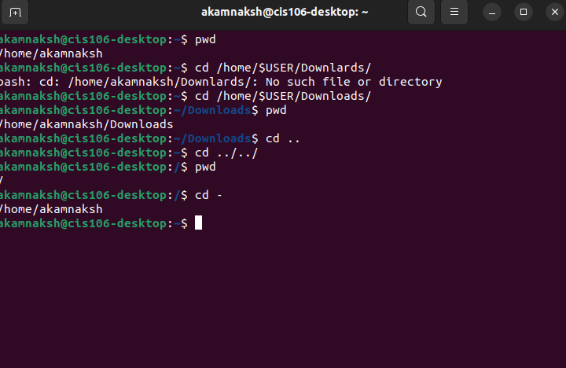
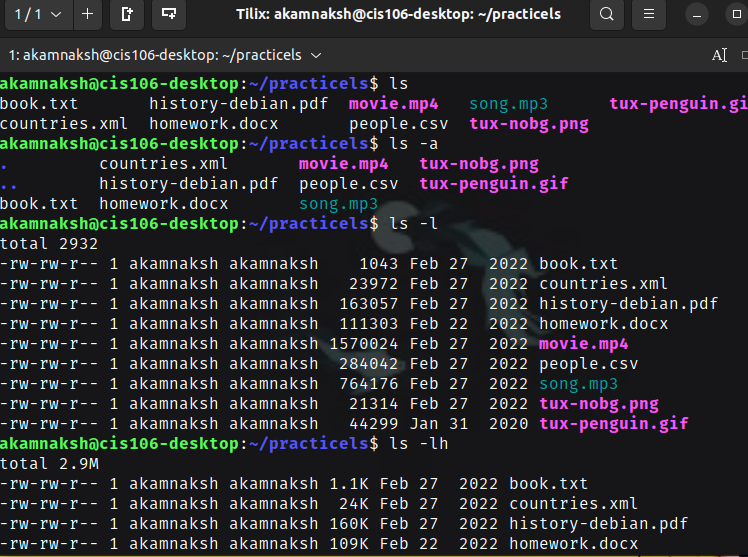
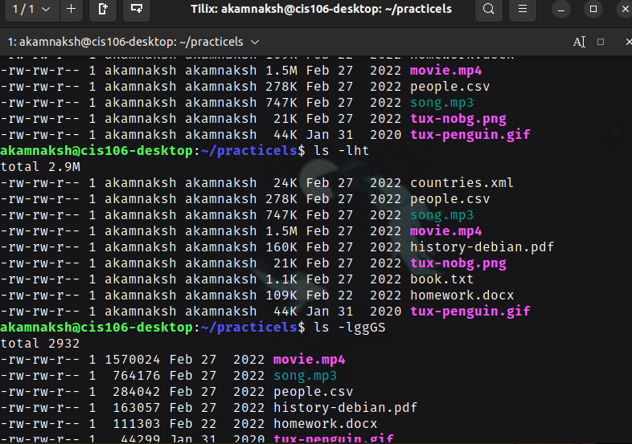
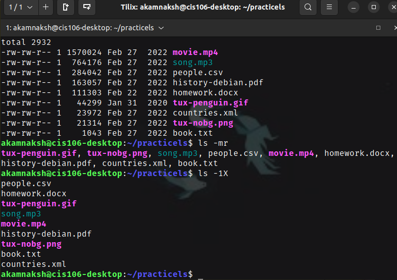
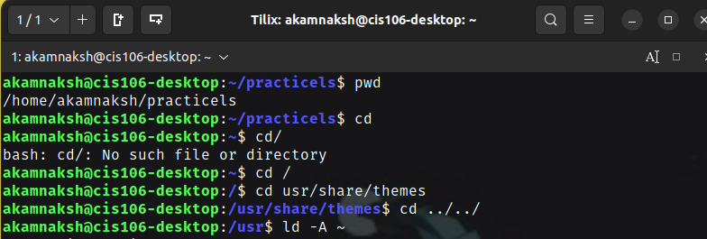
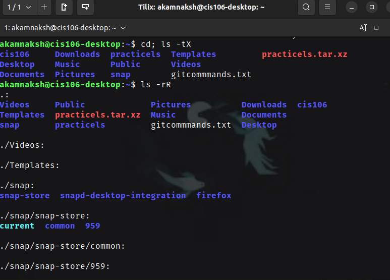
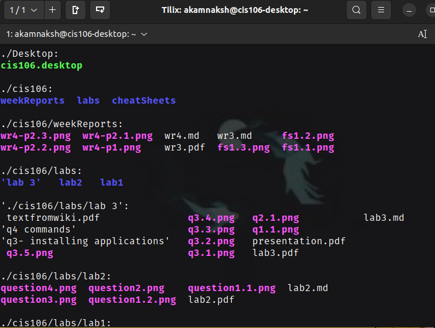
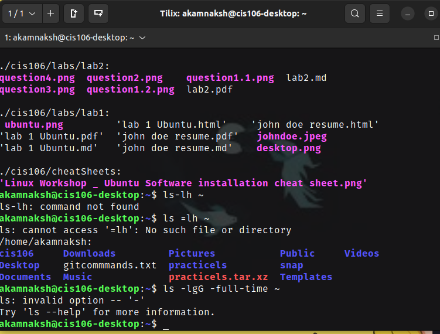

# Week Report 4

## PRACTICE FROM THE PRESENTATION THE LINUX FILE SYSTEM:
### Practice 1
  

### Practice 2
  
  
  

### Practice 3 
  
  
  
  

## THE LINUX FILE SYSTEM DIRECTORIES AND THEIR PURPOSE:

  
  
  

## ALL THE COMMANDS FOR NAVIGATING THE FILESYSTEM:

| Command | What it does                                | Syntax           | Example           |
| ------- | ------------------------------------------- | ---------------- | ----------------- |
| pwd     | displays current working directory          | pwd              | 'pwd'             |
| cd      | changing current working directory          | cd + destination | 'cd $HOME'        |
| ls      | displays all files inside a given directory | Is -a            | 'dir; tree ; exa' |

## Basic terminology
**File system:** the way files are stored and organized.
**Current directory:** the directory where you are at the moment.
**parent directory:** always working inside a particular directory and can move forward to a subdirectory or backwards to the previous directory.
**the difference between YOUR HOME directory and THE HOME directory:** terminal emulator is where you are currently working and thats in your home directory. The home directory however, is when you open file manager.
**pathname:** indicates location of the file in the filesystem.
**relative path:** locations of a file starting from the current working directory or a directory that is loacted inside the current working directory.
**absolute path:** locations of a file starting at the root of the file system